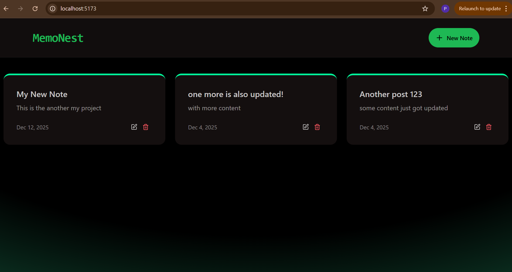
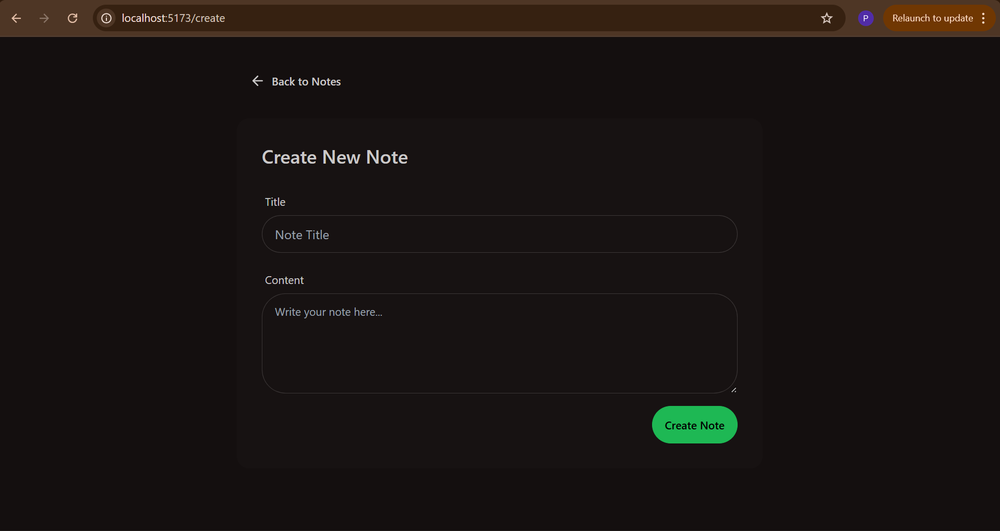
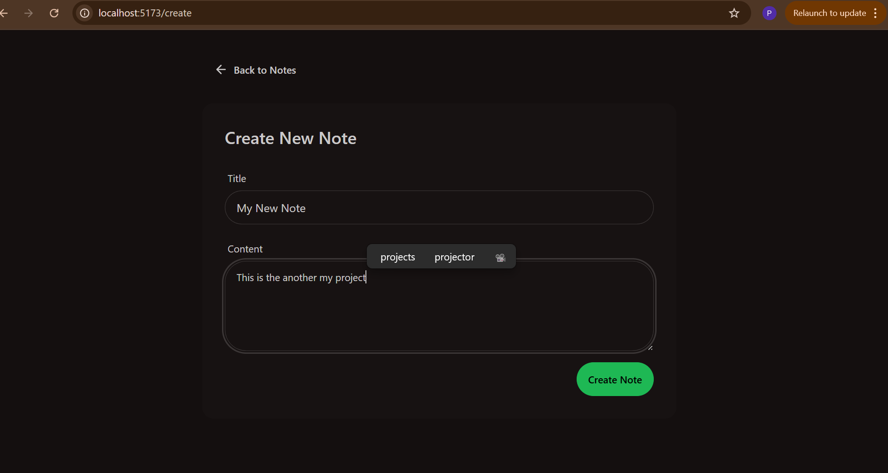
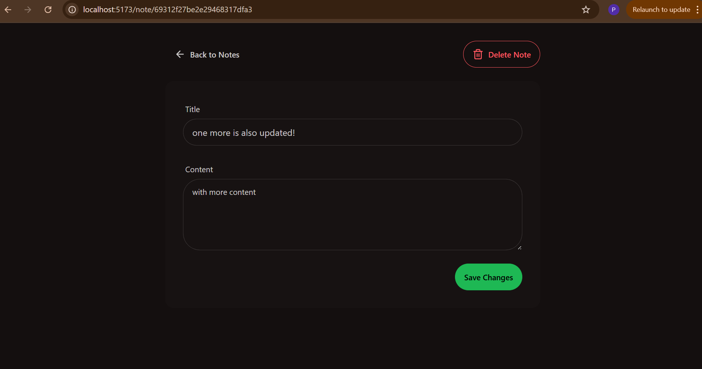
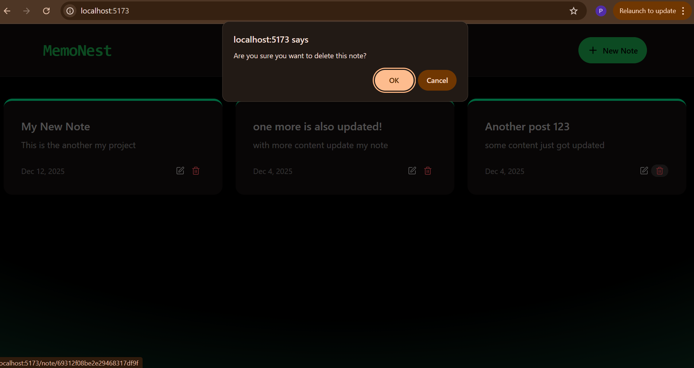
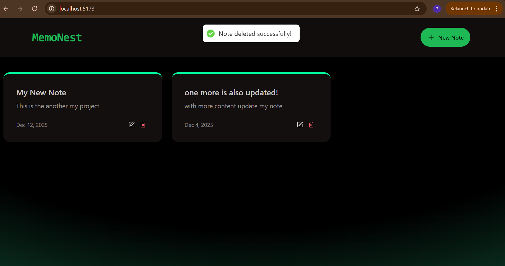
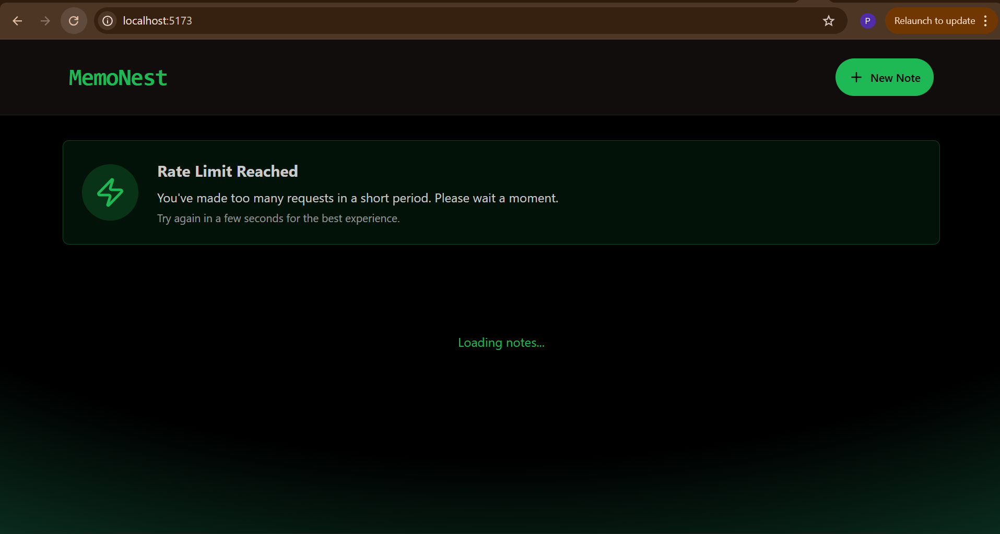

# 🌟 Memonest — MERN Stack Notes App



**Memonest** is a **full-stack notes application** built with the **MERN stack** (MongoDB, Express.js, React.js, Node.js). Users can **create, read, update, and delete notes**.

- [](https://opensource.org/licenses/MIT)
- [](#)
[](#)
- [](#)
- [](https://www.npmjs.com/package/memonest)
- [](https://memonest.onrender.com)

---

## 📚 Table of Contents

- [Features](#features)
- [Tech Stack](#tech-stack)
- [Screenshots](#screenshots)
- [Getting Started](#getting-started)
- [Folder Structure](#folder-structure)

---

## ✨ Features

- ✅ **Create, edit, delete, and view notes**
- ✅ **Responsive UI** 
- ✅ Notes stored in **MongoDB**
- ✅ **RESTful API backend** with Express.js
- ✅ **React frontend** with modern UI
- ✅ **User-friendly interface**

---

## 🛠 Tech Stack

- **Frontend:** React.js, TailwindCSS/DaisyUI
- **Backend:** Node.js, Express.js
- **Database:** MongoDB
- **Libraries & Tools:** Axios, React Router, react-hot-toast, Lucide icons

---

## 📸 Screenshots

**Homepage (Notes List)**  


**Note Create Page**  



**Note Edit Page**  


**Note Delete**  



**Rate Limit**  



---

## 🚀 Getting Started

### 1️⃣ Clone the Repository

```bash
git clone https://github.com/YOUR_USERNAME/memonest.git
cd memonest
```
### 2️⃣ Install Dependencies

Backend

```bash
cd backend
npm install
```
Frontend

```bash
cd ../frontend
npm install
```
### 3️⃣ Setup Environment Variables

Backend (.env):

```bash
MONGO_URI=your_mongodb_connection_string
JWT_SECRET=your_secret_key
PORT=5000
```
Frontend (.env):

```bash
VITE_API_URL=http://localhost:5000
```
4️⃣ Run Locally

Backend

```bash
cd backend
npm run dev
```
Frontend

```bash
cd frontend
npm run dev
```

Open browser: http://localhost:5173

🗂 Folder Structure

```lua 
memonest/
├── backend/
│   ├── controllers/
│   ├── models/
│   ├── routes/
│   ├── package.json
│   └── server.js
├── frontend/
│   ├── src/
│   │   ├── components/
│   │   ├── pages/
│   │   └── App.jsx
│   ├── package.json
│   └── vite.config.js
├── package.json
└── README.md
```


