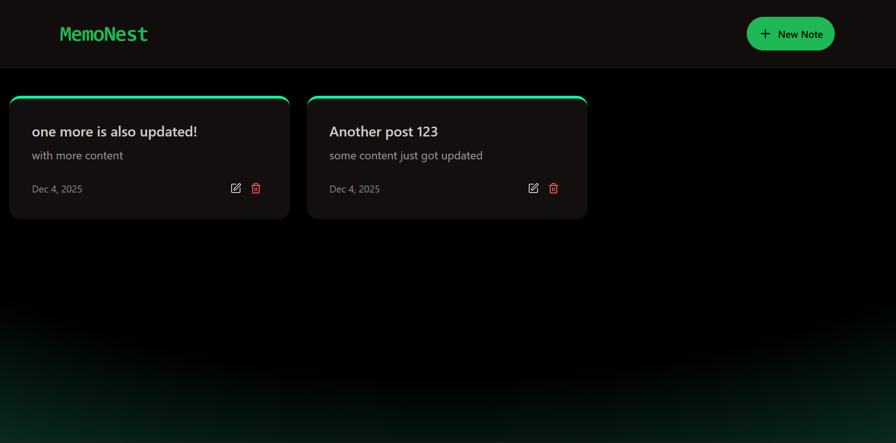

# 🌟 Memonest — MERN Stack Notes App



**Memonest** is a **full-stack notes application** built with the **MERN stack** (MongoDB, Express.js, React.js, Node.js). Users can **create, read, update, and delete notes** and enjoy **light/dark mode**.

- [](https://opensource.org/licenses/MIT)
- [](#)
[](#)
- [](#)
- [](https://github.com/YOUR_USERNAME/memonest/actions)
- [](https://github.com/YOUR_USERNAME/memonest/issues)
- [](https://www.npmjs.com/package/memonest)
- [](https://memonest.onrender.com)

---

## 📚 Table of Contents

- [Features](#features)
- [Tech Stack](#tech-stack)
- [Screenshots](#screenshots)
- [Getting Started](#getting-started)
- [Folder Structure](#folder-structure)
- [Deployment](#deployment)
- [Contributing](#contributing)
- [License](#license)

---

## ✨ Features

- ✅ **Create, edit, delete, and view notes**
- ✅ **Responsive UI** 
- ✅ Notes stored in **MongoDB**
- ✅ **RESTful API backend** with Express.js
- ✅ **React frontend** with modern UI
- ✅ **User-friendly interface**

---

## 🛠 Tech Stack

- **Frontend:** React.js, TailwindCSS/DaisyUI
- **Backend:** Node.js, Express.js
- **Database:** MongoDB
- **Libraries & Tools:** Axios, React Router, react-hot-toast, Lucide icons

---

## 📸 Screenshots

**Homepage (Notes List)**  


**Note Create Page**  


**Note Edit Page**  


**Note Delete**  


**Rate Limit**  


**Theme Toggle**  


> 💡 Save your screenshots in a folder named `screenshots` in your repo.

---

## 🚀 Getting Started

### 1️⃣ Clone the Repository

```bash
git clone https://github.com/YOUR_USERNAME/memonest.git
cd memonest 

---


